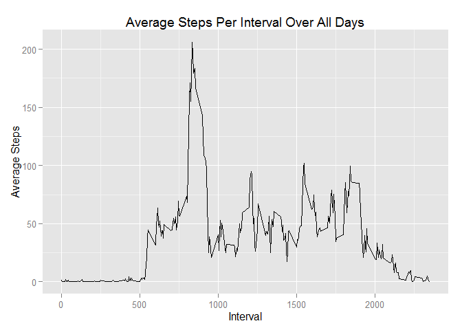

# Reproducible Research: Peer Assessment 1

<br/>

## Loading and preprocessing the data
###1. Load the data

```r
setwd("C:/Users/rsaunders/Google Drive/WGM/Coursera/Reproducible Research/Peer Assessment 1/RepData_PeerAssessment1/activity")
activity<-read.csv("activity.csv")
head(activity)
```

```
##   steps       date interval
## 1    NA 2012-10-01        0
## 2    NA 2012-10-01        5
## 3    NA 2012-10-01       10
## 4    NA 2012-10-01       15
## 5    NA 2012-10-01       20
## 6    NA 2012-10-01       25
```
###2. Process/transform the data (if necessary) into a format suitable for your analysis
There is no need for further processing until future steps.  
<br/>

## What is mean total number of steps taken per day?
###1. Calculate the total number of steps per day

```r
library(stats)
total.steps.per.day<-aggregate(steps ~ date, data=activity, FUN=sum)
head(total.steps.per.day)
```

```
##         date steps
## 1 2012-10-02   126
## 2 2012-10-03 11352
## 3 2012-10-04 12116
## 4 2012-10-05 13294
## 5 2012-10-06 15420
## 6 2012-10-07 11015
```

###2. Make a histogram of the total number of steps taken each day

```r
library(ggplot2)
q<-qplot(steps,data=total.steps.per.day, geom="histogram", xlab="Steps Per Day", ylab="Frequency", main="Frequencies of Steps Per Day")
q + theme(axis.text.x = element_text(angle = 90, hjust = 1, size=8))
```

```
## stat_bin: binwidth defaulted to range/30. Use 'binwidth = x' to adjust this.
```

 
<br/>

###3. Calculate the Mean and Median of the Total Number of Steps Taken Per Day

```r
mean.steps<-mean(total.steps.per.day$steps)
median.steps<-median(total.steps.per.day$steps)
```

####The mean of steps per day is 10,766 and the median of steps per day is 10,766.
<br/>

## What is the average daily activity pattern?

###1. Make a time series plot (i.e. type = "l") of the 5-minute interval (x-axis) and the average number of steps taken, averaged across all days (y-axis)

```r
avg.steps.per.interval<-aggregate(steps ~ interval, data=activity, FUN=mean)
qplot(interval, steps , stat="identity", data=avg.steps.per.interval, geom="line", xlab="Interval", ylab="Average Steps", main="Average Steps Per Interval Over All Days")
```

 
<br/>

###2. Which 5-minute interval, on average across all the days in the dataset, contains the maximum number of steps?

```r
maximum.interval<-avg.steps.per.interval$interval[avg.steps.per.interval$steps==max(avg.steps.per.interval$steps)]
```
####The interval with the maximum number of average steps is interval 835 with 206 steps on average.
<br/>

## Imputing missing values
###1. Calculate and report the total number of missing values in the dataset (i.e. the total number of rows with NAs)

```r
NA.rows<-sum(is.na(activity$steps))
```
####There are 2,304 rows that have NA values.

###2. Devise a strategy for filling in all of the missing values in the dataset. (I will use the average steps of the intervals)

```r
#Use sapply to obtain a vector of interval means based on the intervals in activity dataset
activity$interval.means<-sapply(activity$interval, function(x,y){y$steps[x==y$interval]}, avg.steps.per.interval)
```

###3.Create a new dataset that is equal to the original dataset but with the missing data filled in.

```r
#set NA values to the interval.means column
activity.imputed<-activity
activity.imputed$steps[is.na(activity.imputed$steps)]<-activity.imputed$interval.means[is.na(activity.imputed$steps)]
head(activity.imputed[,1:3])
```

```
##       steps       date interval
## 1 1.7169811 2012-10-01        0
## 2 0.3396226 2012-10-01        5
## 3 0.1320755 2012-10-01       10
## 4 0.1509434 2012-10-01       15
## 5 0.0754717 2012-10-01       20
## 6 2.0943396 2012-10-01       25
```

###4. Make a histogram of the total number of steps taken each day and Calculate and report the mean and median total number of steps taken per day. Do these values differ from the estimates from the first part of the assignment? What is the impact of imputing missing data on the estimates of the total daily number of steps?
<br/>

####Histogram

```r
total.steps.imputed<-aggregate(steps ~ date, data=activity.imputed, FUN=sum)
q<-qplot(steps,data=total.steps.imputed, geom="histogram", xlab="Steps Per Day", ylab="Frequency", main="Frequencies of Steps Per Day")
q + theme(axis.text.x = element_text(angle = 90, hjust = 1, size=8))
```

```
## stat_bin: binwidth defaulted to range/30. Use 'binwidth = x' to adjust this.
```

 

####Median Mode Comparison

```r
library(xtable)
mean.steps.imputed<-mean(total.steps.imputed$steps)
median.steps.imputed<-median(total.steps.imputed$steps)
mean.change<-round((mean.steps.imputed/mean.steps-1)*100,digits=4)
median.change<-round((median.steps.imputed/median.steps-1)*100,digits=4)
#d <- data.frame(Measure = c("mean", "median"), Original = c(mean.steps,median.steps), Imputed = c(mean.steps.imputed, median.steps.imputed))
d <- data.frame(Dataset = c("Original Data", "Imputed Data"), Mean = c(mean.steps,mean.steps.imputed), Median = c(median.steps, median.steps.imputed))
xt<-xtable(d, align=rep("c",4))
print(xt, align = "center", type = "html", include.rownames=FALSE, format.args=list(big.mark = ",", decimal.mark = "."), html.table.attributes=list("align='left', border=1, width=300"))
```

<!-- html table generated in R 3.2.2 by xtable 1.8-0 package -->
<!-- Fri Nov 13 15:39:47 2015 -->
<table align='left', border=1, width=300>
<tr> <th> Dataset </th> <th> Mean </th> <th> Median </th>  </tr>
  <tr> <td align="center"> Original Data </td> <td align="center"> 10,766.19 </td> <td align="center"> 10,765.00 </td> </tr>
  <tr> <td align="center"> Imputed Data </td> <td align="center"> 10,766.19 </td> <td align="center"> 10,766.19 </td> </tr>
   </table>
<br/><br/><br/><br/>

####There was very little impact resulting from imputing NA values.  The % difference of the imputed mean vs. the original mean was 0%.  The difference of the imputed median vs. the original medium was 0.011%.
<br/>

## Are there differences in activity patterns between weekdays and weekends?

###1. Create a new factor variable in the dataset with two levels -- "weekday" and "weekend" indicating whether a given date is a weekday or weekend day.

```r
dayofweek<-weekdays(as.POSIXct(activity.imputed$date))
weekday.weekend<-sapply(dayofweek,function(x){ifelse(x=="Saturday"|x=="Sunday","Weekend","Weekday")})
activity.imputed$weekday.or.weekend<-weekday.weekend
head(activity.imputed)
```

```
##       steps       date interval interval.means weekday.or.weekend
## 1 1.7169811 2012-10-01        0      1.7169811            Weekday
## 2 0.3396226 2012-10-01        5      0.3396226            Weekday
## 3 0.1320755 2012-10-01       10      0.1320755            Weekday
## 4 0.1509434 2012-10-01       15      0.1509434            Weekday
## 5 0.0754717 2012-10-01       20      0.0754717            Weekday
## 6 2.0943396 2012-10-01       25      2.0943396            Weekday
```

###2. Make a panel plot containing a time series plot (i.e. type = "l") of the 5-minute interval (x-axis) and the average number of steps taken, averaged across all weekday days or weekend days (y-axis). 

```r
avg.steps.per.interval<-aggregate(steps ~ interval+weekday.or.weekend, data=activity.imputed, FUN=mean)
qplot(interval, steps , stat="identity", color=weekday.or.weekend, facets=weekday.or.weekend~., data=avg.steps.per.interval, geom="line",show_guide=FALSE, xlab="Interval", ylab="Average Steps", main="Average Steps Per Interval Over All Days") + theme(legend.position="none")
```

 
